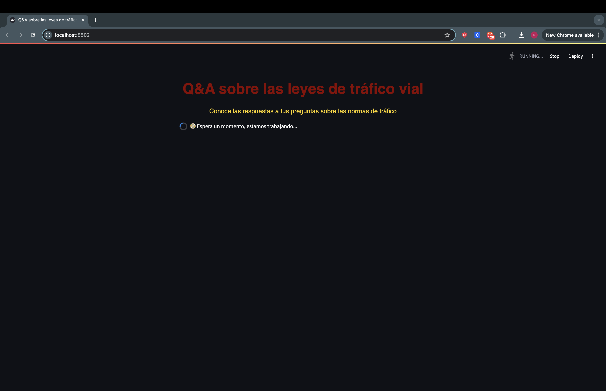
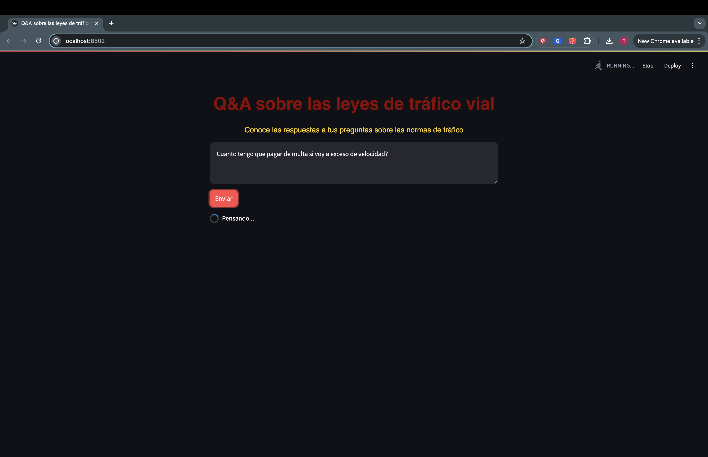
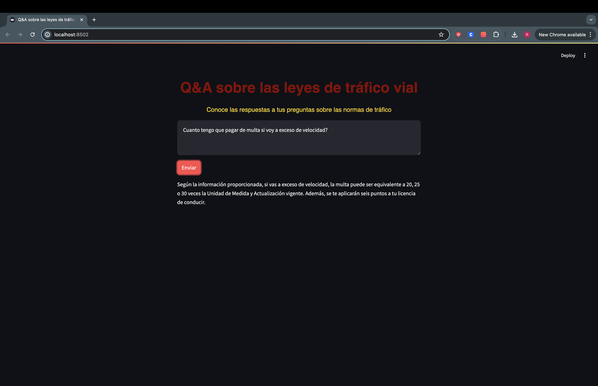

# Traffic_Regulations_Chatbot

### Project overview
* Developed a chatbot application to help users to clarify questions about Mexico City's traffic regulations
* Leveraged LangChain, AWS Bedrock, and OpenSearch for the backend infrastructure.
* Implemented the Retrieval-Augmented Generation methodology, using Titan for embeddings and Claude Haiku as the Language Model.

  

  

### Part 1: Creating a Vector Database
- Implemented AWS OpenSearch: Utilized the boto3 library to interact with the AWS OpenSearch service, establishing a secure and scalable vector database.
- Why AWS OpenSearch? Selected for its efficient vector storage and retrieval capabilities, seamless integration with AWS services, and advanced security features—making it an optimal choice for this chatbot application.
- You can see the full and detailed script used to create this DB **[HERE](https://github.com/Roberto121c/Traffic_Regulations_Chatbot/blob/main/code/opensearch_db.py)**

### Part 2: Backend
- PDF Processing: Developed a function to load PDF documents and split them into smaller, manageable chunks.
- Embedding Generation: Configured AWS Bedrock with Titan to generate embeddings from the processed PDFs.
- Vector Storage: Stored the generated embeddings in an OpenSearch index, functioning as the vector database.
- QA Chain Setup: Combined the vector database as retrival with the LLM, creating a pipeline that takes a user query, retrieves relevant document sections, and generates a concise answer.
- You can see the full and detailed backend script **[HERE](https://github.com/Roberto121c/Traffic_Regulations_Chatbot/blob/main/code/backend.py)**

### Part 3: Frontend
- User Interface: Developed a user-friendly interface using Streamlit, allowing users to easily interact with the chatbot.
- Backend Integration: Seamlessly integrated backend functionalities into the frontend, enabling real-time user query submission and response generation.
- Performance Optimization: Implemented session management to ensure the vector index is only initialized once, optimizing performance and user experience.
- You can see the full and detailed frontend script **[HERE](https://github.com/Roberto121c/Traffic_Regulations_Chatbot/blob/main/code/frontend.py)**

### Demo

- First we initialize the app

- We ask the question

- We get the answer

### Conclusions
* Successful Implementation: Developed an effective chatbot application for clarifying Mexico City's traffic regulations, demonstrating a solid application of LangChain, AWS Bedrock, and OpenSearch.
* Methodology Efficiency: The use of RAG with Titan embeddings and Claude Haiku as the LLM proved to be an efficient approach, providing users with precise and contextual answers.

